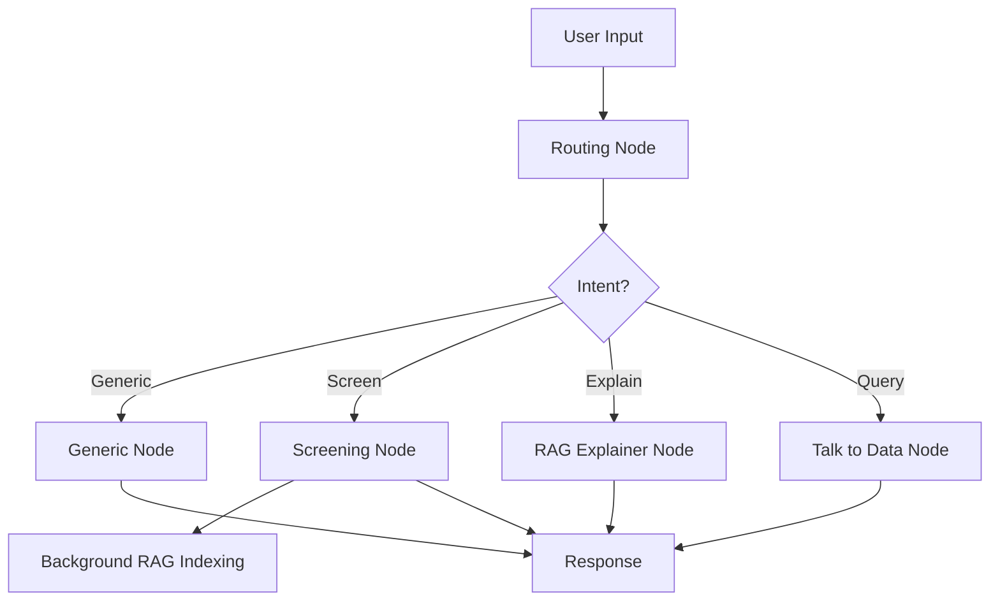

# Incorta Recruitment Demo System

A comprehensive AI-powered recruitment system with CV screening, RAG-based candidate analysis, and intelligent querying capabilities.

## 🚀 Features

- **Multi-threaded Job Management**: Separate recruitment threads for different positions
- **CV Upload & Vectorization**: Automatic CV processing and embedding storage
- **Initial Keyword Filtering**: Pre-screening based on required skills
- **AI-Powered Screening**: Match candidates against job descriptions with scoring
- **RAG Explanations**: Qualitative analysis explaining why candidates scored certain ways
- **Talk to Data**: Natural language queries to filter and analyze candidates
- **Conversation Memory**: Context-aware conversations with summary + recent messages

## 📋 Prerequisites

- Python 3.9+
- Google Gemini API key
- 4GB+ RAM recommended

## 🔧 Installation

1. **Clone the repository**
```bash
git clone <repository-url>
cd recruitment_demo
```

2. **Create virtual environment**
```bash
python -m venv venv
source venv/bin/activate  # On Windows: venv\Scripts\activate
```

3. **Install dependencies**
```bash
pip install -r requirements.txt
```

4. **Set up environment variables**
Create a `.env` file:
```
GOOGLE_API_KEY=your_google_gemini_api_key_here
DB_PATH=database/store/candidates.db
TABLE_NAME=candidates
ENCODER_MODEL_DIR=database/store/encoder_model
INDEX_STORE_PATH=database/store/index_store
CVS_PATH=assets/cvs
```

5. **Initialize directories**
```bash
mkdir -p assets/cvs
mkdir -p database/store
mkdir -p database/store/index_store
```

## 🎯 Usage

### Start the application
```bash
python main.py
```

The application will be available at `http://localhost:8000`

### Using the Web Interface

1. **View Jobs**: Navigate to homepage to see available positions
2. **Select Position**: Click on a job card to enter the chat interface
3. **Upload CVs**: Use the upload endpoint or integrate file upload in UI
4. **Screen Candidates**: Ask "screen the CVs" or "screen 20 CVs"
5. **Query Data**: "show candidates with Python" or "list top 10 by score"
6. **Get Insights**: "why did candidate 5 score higher than candidate 3?"

### API Endpoints

#### Chat Endpoint
```bash
POST /api/chat
{
  "user_message": "screen the CVs",
  "thread_id": "senior_ai_ml"
}
```

#### Upload CVs
```bash
POST /api/upload_cvs
Content-Type: multipart/form-data

files: [file1.pdf, file2.pdf, ...]
thread_id: senior_ai_ml
```

#### Initial Filter
```bash
POST /api/initial_filter
Content-Type: application/x-www-form-urlencoded

thread_id: senior_ai_ml
filter_config: {
  "Technical Skills": {
    "keywords": ["Python", "Machine Learning", "TensorFlow"],
    "required_ratio": 0.6
  }
}
```

## 📁 Project Structure
```
recruitment_demo/
├── main.py                 # FastAPI application
├── graph.py               # LangGraph workflow
├── requirements.txt       # Dependencies
├── .env                  # Environment variables
├── config/               # Configuration files
│   ├── llm_config.py
│   ├── vector_config.py
│   └── database_config.py
├── models/               # Data models
│   ├── state.py
│   ├── conversation.py
│   ├── cv_schema.py
│   └── jd_schema.py
├── nodes/                # Workflow nodes
│   ├── routing.py
│   ├── generic.py
│   ├── screening.py
│   ├── rag_explainer.py
│   └── talk_to_data.py
├── utils/                # Utility functions
│   ├── cv_processing.py
│   ├── cv_extraction.py
│   ├── screening_engine.py
│   ├── rag_retrieval.py
│   └── sql_generator.py
├── prompts/              # LLM prompts
│   ├── routing_prompt.py
│   ├── extraction_prompt.py
│   └── rag_prompt.py
├── database/             # Database files
│   ├── schema.py
│   └── store/
└── assets/               # Uploaded CVs
    └── cvs/
```

## 🎨 Workflow


## 🔑 Key Components

### LangGraph Workflow
- **Routing Node**: Classifies user intent
- **Generic Node**: Handles general questions
- **Screening Node**: Scores CVs against JD
- **RAG Explainer**: Provides qualitative analysis
- **Talk to Data**: SQL-based queries

### Conversation Store
- Maintains summary + last 5 messages per thread
- Auto-summarizes old messages using LLM
- Persistent storage per thread

### Vector Database
- Chroma for CV chunk storage
- Separate RAG index for candidate profiles
- Thread-based isolation

## 🧪 Testing
```python
# Test workflow
from graph import run_workflow

result = run_workflow(
    "screen the CVs",
    thread_id="senior_ai_ml",
    job_description="AI Engineer with 5+ years experience..."
)

print(result["response_message"])
```

## 🐛 Troubleshooting

### Common Issues

1. **"No text extracted from CV"**
   - Ensure PDFs are text-based (not images)
   - Check PDF file is not corrupted

2. **"Vector index not found"**
   - Run initialization: `mkdir -p database/store/index_store`

3. **"Google API error"**
   - Verify API key in `.env`
   - Check API quota limits

## 📝 License

MIT License

## 🤝 Contributing

Contributions welcome! Please open an issue or submit a pull request.

## 📧 Support

For support, email: support@example.com